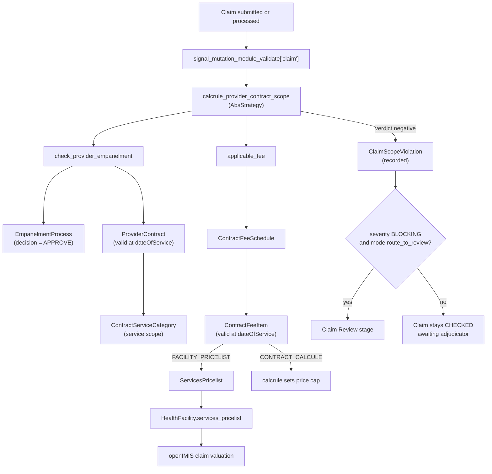

# openIMIS Provider Contract & Empanelment

[](https://www.gnu.org/licenses/agpl-3.0)
[](https://openimis.org/)
[](https://www.digitalpublicgoods.net/)

Provider empanelment, contract lifecycle, and per-contract fee schedules for
[openIMIS](https://openimis.org/) — replacing the spreadsheet that currently
holds this data in most schemes.

> **Status: pre-alpha.** The schema, its migrations, the legacy backfill, the
> service layer and the GraphQL surface are all in place and reachable over the
> API. The claims-gate *calculation rule* is a separate module and is not
> started. See [Maturity](#maturity) for exactly what does and does not work
> today.

---

## The problem

Every health insurance scheme on openIMIS has to answer one question before it
pays a claim: *is this provider actually contracted for this service?* Today that
answer lives in a spreadsheet, a Word document, or — increasingly often — in
nobody's head at all.

The consequences are concrete and recurring:

- **Claims paid outside contract scope.** A facility contracted for Level 1
  services bills Level 3 procedures, and nothing in the system objects.
- **Fee schedules drift.** An inflation adjustment agreed in negotiation never
  reaches the pricelist the claims engine reads.
- **No audit trail.** "Was this provider credentialed? By whom? When?" has no
  answer that survives an audit.
- **Renewals are missed.** Contracts lapse silently; there is no sweep, no
  reminder, no grace period.
- **Renewable expertise leaves with the officer.** The knowledge of why a
  facility was rejected lives nowhere but email.

## What this module does

**1. Provider empanelment workflow.** A configurable multi-stage approval —
application → document verification → site visit → committee review → decision —
with a document checklist (licence, accreditation, lab certification) and a
tamper-evident transition log recording who did what, when, and why. Stage
count is data, not code: a scheme that needs three stages and a scheme that
needs seven both get it from configuration.

**2. Contract lifecycle management.** Draft → under negotiation → signed →
active → up for renewal → renewed / terminated / expired, with effective dates,
renewal windows, auto-renewal and termination notice periods. Every amendment
creates a new version and archives the previous one, so the terms in force on a
given date are always reconstructible.

**3. Per-contract fee schedules.** Fee-for-service and bundled pricing, scoped
to one contract rather than global. Effective-dated, so a mid-term price change
is a new row with a start date rather than an in-place overwrite. On activation
the schedule is materialized into an openIMIS `ServicesPricelist`, so the
existing claim valuation engine prices the claim with no modification.

**4. Claims gate.** Two read-only GraphQL queries answer "is this provider
empanelled for this service on this date?" and "what does this service cost
under their current contract?". Failures are **flagged for human review, never
auto-rejected**.

## Why this belongs in openIMIS

This is a module, not a fork. It plugs into entities openIMIS already has and
adds no parallel pricing engine:

| Reused | From |
|---|---|
| `HealthFacility` as the provider entity | `location` |
| Service and item catalogues, `packagetype` bundles | `medical` |
| `ServicesPricelist` / `ItemsPricelist` as the pricing target | `medical_pricelist` |
| Benefit-package scoping via `Product` | `product` |
| Calculation-rule hook for pricing and validation | `calcrule_*` |
| Claim Review stage for flagged claims | `claim` |

The consequence is worth stating plainly: because fees land in a standard
pricelist, claims priced under a provider contract are priced by the same code
path as every other claim in the system. There is no second engine to keep
correct.

## The integration queries

```graphql
query IsProviderEmpaneled {
  check_provider_empanelment(
    provider: "a3f1c0d2-..."        # HealthFacility.uuid (String, not UUID)
    serviceCode: "CONSULT-GEN"
    dateOfService: "2026-10-02"
  ) {
    empaneled
    reasonCode        # NOT_EMPANELLED | OUTSIDE_SCOPE | CONTRACT_EXPIRED |
                      # NO_ACTIVE_CONTRACT | LICENSE_EXPIRED | NO_FEE_MATCH
    severity          # INFO | WARNING | BLOCKING
    contractUuid
    contractVersion
    validityFrom
    validityTo
  }
}

query ApplicableFee {
  applicable_fee(
    provider: "a3f1c0d2-..."
    serviceCode: "CONSULT-GEN"
    dateOfService: "2026-10-02"
  ) {
    found
    amount            # Decimal(18,2), matches price_overrule
    currency
    resolutionMode    # FACILITY_PRICELIST | CONTRACT_CALCULE
    contractUuid
    contractVersion
    feeItemUuid
    pricelistUuid
  }
}
```

Both queries are pure reads. They never raise on a negative result and never
mutate a claim; a negative verdict is data, not an exception.

## Architecture



The gate never removes, cancels, or edits a claim. On a negative verdict it
writes one `ClaimScopeViolation` row and stops.

## Configuration

Everything is tunable through openIMIS `ModuleConfiguration`, with defaults that
make the module inert-but-correct when unconfigured:

| Key | Default | Effect |
|---|---|---|
| `pce_gate_enabled` | `True` | `False` disables the gate entirely |
| `pce_gate_mode` | `flag_only` | `route_to_review` additionally routes BLOCKING verdicts to the claim Review stage |
| `pce_fee_resolution_mode` | `FACILITY_PRICELIST` | `CONTRACT_CALCULE` supports many concurrent contracts per facility |
| `pce_gate_cache_ttl_seconds` | `300` | Gate memoization window |
| `pce_default_renewal_window_days` | `60` | Used when a contract omits one |
| `pce_default_grace_period_days` | `30` | De-empanelment grace period (v2) |

Permissions use the `153xxx` right block, grouped as `1530xx` administration,
`1531xx` empanelment, `1532xx` contract, `1533xx` fees, `1534xx` claims gate.

## Install

Register the module in the assembly manifest and migrate:

```json
// openimis.json  —  CI and production
{
  "name": "provider_contract",
  "pip": "git+https://github.com/openimis/openimis-be-provider_contract_py.git@develop#egg=openimis-be-provider-contract"
}
```

```bash
cd openIMIS
OPENIMIS_CONF=../openimis-dev.json python manage.py test --keepdb --timing provider_contract
```

The suite needs PostgreSQL. The CI image (`ghcr.io/openimis/openimis-pgsql`)
also ships the **legacy `tbl*` schema**, because many openIMIS models are
`managed = False` and Django never creates their tables. Without that schema
`migrate` fails on a foreign key to `tblUsers`, `tblBill` and friends. If you
are running outside CI, see the "Running the tests without Docker" section.

Requires Python 3.11, Django 4.2 and the openIMIS backend assembly
([openimis-be_py](https://github.com/openimis/openimis-be_py)). `manage.py` sits
directly in `openIMIS/`, not in `backend/openIMIS/`.

Migrations are split in two batches on purpose:

1. `0001_initial` — empanelment, contract and fee entities. Installable on its
   own, with no dependency on the `claim` module.
2. `0002_claim_scope_violation` — the violation log that holds foreign keys into
   `claim`, so a deployment that only wants contract governance does not inherit
   a hard dependency on the claim schema.

`0003_backfill_contracts_from_health_facility` then imports existing
`HealthFacility.contract_start_date` / `contract_end_date` pairs as contracts.
It is forward-only (a reverse would delete financial history), idempotent, and
skips facilities whose legacy dates are inverted or missing.

### Seeding the empanelment catalogue

The default workflow, its five stages and the document checklist ship as a
management command rather than a data migration:

```bash
OPENIMIS_CONF=../openimis.json python manage.py seed_empanelment_catalogue --user admin
```

This is deliberate. Every entity inherits `HistoryModel`, whose `user_created`
and `user_updated` are non-nullable foreign keys to `core.User` — and on a
fresh install there is no user to attribute the rows to yet, even though the
catalogue is exactly what a fresh install needs first. openIMIS core reached the
same conclusion: its own `insert_role_right_for_system` is stubbed out with the
comment *"do not manage the role and right via migrations"*. The command is
idempotent and matches on `code`, so a deployment that has customised a stage
keeps its customisation.

## Running the tests without Docker

CI gets a working database from `ghcr.io/openimis/openimis-pgsql`, which is not
just PostgreSQL — it is PostgreSQL **preloaded with the openIMIS legacy
schema**. Four things are non-obvious and each one fails confusingly:

1. **The legacy schema must be loaded before migrating.** A large share of
   openIMIS's models are `managed = False` and point at legacy `tbl*` tables
   that Django will never create, while other tables carry foreign keys *into*
   them. `migrate` dies on `relation "tblUsers" does not exist`. The schema
   lives in [`openimis/database_postgresql`](https://github.com/openimis/database_postgresql)
   under `database scripts/`.
2. **Load the same files the image does**, in lexical order:
   `00_dump.sql`, `02_aux_functions.sql`, `03_views.sql`, `04_functions.sql`,
   `05_stored_procs.sql`. The Dockerfile's `COPY` glob is `0[2345]_*.sql`, so
   `01_modular_base.sql` and `01_django.sql` are deliberately *not* part of the
   image. Loading extra files diverges from what CI tests.
3. **Do not create a `django` schema.** openIMIS sets
   `search_path=django,public`, and it relies on `django` being *absent* so
   everything resolves to `public`. Create it and each Django-created table
   lands in `django` while the sequences its own migrations add unqualified land
   in `public`, which fails at `claim.0026_add_sequences` with *"sequence must
   be in same schema as table it is linked to"*.
4. **`json_schema_extension.sql` can be skipped.** The `postgres-json-schema`
   extension has to be compiled, and nothing in the schema or in any installed
   module calls `json_schema_is_valid` — verified, zero references.

A working recipe using the `pgserver` wheel (bundles a PostgreSQL 16, no
install required) is ~120 lines: start the server, load the five SQL files into
a fresh database, export `DB_DEFAULT=postgresql` and friends, then
`call_command("test", "--keepdb", "provider_contract")`.

Two smaller traps if you go this route:

- `pgserver` shuts the server down when the interpreter exits, so the server,
  the schema load and the test run have to share one process.
- The bundled build ships no `share/postgresql/timezone` directory, so it
  rejects `SET TIME ZONE 'UTC'` and falls back to `GMT`. openIMIS pins
  `TIME_ZONE = "UTC"`, and because Django only issues that `SET` when the
  configured zone differs from the one the server reports, priming the
  connection wrapper's `timezone_name` with `"GMT"` makes it a no-op.

## Maturity

Honest accounting of what exists:

| Area | State |
|---|---|
| Schema, indexes, constraints | **Done** — 13 models + 12 mutation-log companions, split into two migration batches so the schema installs without a hard dependency on `claim` |
| Contract backfill from legacy `HealthFacility` columns | **Done** — forward-only `RunPython` migration (`0003`), idempotent, skips unusable legacy dates |
| Default stage & document catalogue | **Done** — `seed_empanelment_catalogue` management command, not a migration (see below) |
| Automated tests | **Done** — 135 tests green against PostgreSQL: model invariants, district row security, the backfill migration, the seed command, the contract state machine, the claims gate, and GraphQL queries/mutations through the openIMIS harness |
| Service layer | **Done** — contract lifecycle with amendment versioning, empanelment workflow execution, fee schedules with pricelist materialization, advisory claims gate |
| GraphQL queries and mutations | **Done** — 19 queries, 28 mutations; permissions enforced, row security delegated to the models, failures recorded on the `MutationLog` |
| Claims gate calcrule (`openimis-be-calcrule_provider_contract_scope_py`) | Not started — a separate module; the gate queries it would call are done |
| FE module, demo dataset, benchmarks | Not started |

Do not deploy this against production data yet. It is offered to the openIMIS
initiative for review and co-development, not as a supported release.

### Bugs the test suite caught

Worth recording, because every one of them was invisible to `manage.py check`
and to a static read of the code:

* **`contract_number` was `unique=True`, which broke every amendment and
  renewal.** `replace_object` copies the row and keeps the number, so the second
  version of any contract could not be inserted. Fixed in migration `0004`; the
  "one open version per number" rule is service-enforced instead (ADR-002).
* **`amend()` and `renew()` read the version link backwards.**
  `replace_object` returns `None` and writes the *successor's* id onto the row it
  superseded, so `objects.get(replacement_uuid=contract.id)` raised
  `DoesNotExist`. Both amendments and renewals were dead on arrival.
* **The backfill migration would have crashed a real `migrate`.** It read
  `ProviderContract.Status.EXPIRED`, but a migration receives a plain historical
  model that has no nested `TextChoices` classes. Migration 0003 spells the
  literals out now.
* **Row security could be silently disabled.** `get_queryset` probed
  `user.is_anonymous` before normalising the actor — `InteractiveUser` has no
  such attribute, so it raised `AttributeError` — and then passed whatever it
  had to `build_user_location_filter_query`, which returns the queryset
  **unfiltered** for an actor it does not recognise. It now resolves the actor
  explicitly and empties the queryset when it cannot.
* **`ClaimScopeViolation.record()` could not save.** `service_code` is
  `NOT NULL` and was never populated, and the code lives on the `medical.Service`
  that `ClaimService` points at rather than on `ClaimService` itself.
* **`EmpanelmentService.submit()` raised `AttributeError`.** It called
  `self._stages(workflow).first()`, but `_stages` returns a **list**, so
  submitting an application — the very first step of the workflow — always
  failed. `_next_stage` had the same mistake. Both were invisible until the
  GraphQL test drove a real submit.
* **Every mutation returned a dict, which marked all of them failed.**
  `OpenIMISMutation` reads `async_mutate`'s return value as `error_messages`;
  a truthy dict goes to `mark_as_failed` and into `MutationLog.error`. A client
  creating a contract got a failed mutation even though the contract existed.
  `None` is the only success signal.

## Roadmap

| Version | Scope |
|---|---|
| 0.1.0 | Empanelment workflow, contract lifecycle with amendment versioning, FFS + bundled fee schedules, claims gate (flag-only) |
| 0.2.0 | DRG and capitation/PMPM pricing, provider scorecards and KPI alerts, de-empanelment with grace period, bulk operations and CSV import |
| 0.3.0 | Provider self-service portal, individual practitioner (HCP) credentialing |

Design decisions are recorded as architecture decision records — fee
materialization, portable DDL, superseding the legacy `HealthFacility` contract
columns, configurable fee resolution, the absence of a `schemeId`, and the
advisory-only gate. See the ADR table in [AGENTS.md](AGENTS.md).

## Contributing

See [CONTRIBUTING.md](CONTRIBUTING.md) for the workflow, and
[AGENTS.md](AGENTS.md) for the architectural rules a change must respect —
in particular that migrations are generated rather than hand-written, and that
the claims gate flags rather than rejects.

## Sponsorship and partnerships

openIMIS is a **certified Digital Public Good** stewarded as a global
initiative. This module is developed in the open and offered to that
initiative; sponsorship is coordinated through the official channels rather
than this repository.

- openIMIS partners and funding: <https://openimis.org/partners>
- Contact the initiative: <contact@openimis.org>
- Developer documentation: <https://openimis.atlassian.net/wiki/>

Relevant openIMIS funding channels include Digital Square, GovStack, P4H and
OpenHIE. Contributions to openIMIS modules are in scope for those programmes
because the module is AGPL v3 and part of the same ecosystem.

## License

AGPL v3 — see [LICENSE.md](LICENSE.md). openIMIS itself is distributed under
AGPL v3, and modules must be license-compatible.